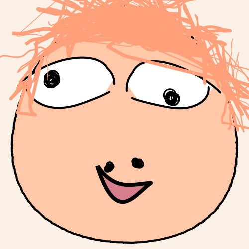

# ugly-avatar-python

最近看到了这个好玩的项目，花了点时间让ChatGPT实现了一下。

1、请自行安装项目所有依赖，pip一下。

2、如遇报错，大概率是svg2png过程中`cairosvg`包的问题，请自行pip安装，并安装项目下的`gtk2-runtime-2.24.33-2021-01-30-ts-win64.exe`安装包即可解决。

3、Good luck !

## 原项目地址：

https://github.com/txstc55/ugly-avatar

## 原项目声明：

This project is under Attribution-NonCommercial 4.0 International License. This means no commercial use for the project. I thought about this for a time. If you want to use this as part of your website that needs an avatar generator, you are free to use it. If you however, buid an app solely on this code as your main project, I am highly against that practice. I don't want to have the frustration of "oh someone copied my code and made money with it".

Visit the website: https://txstc55.github.io/ugly-avatar

I have seen a good amount of copycat websites. I am fairly disappointed.

